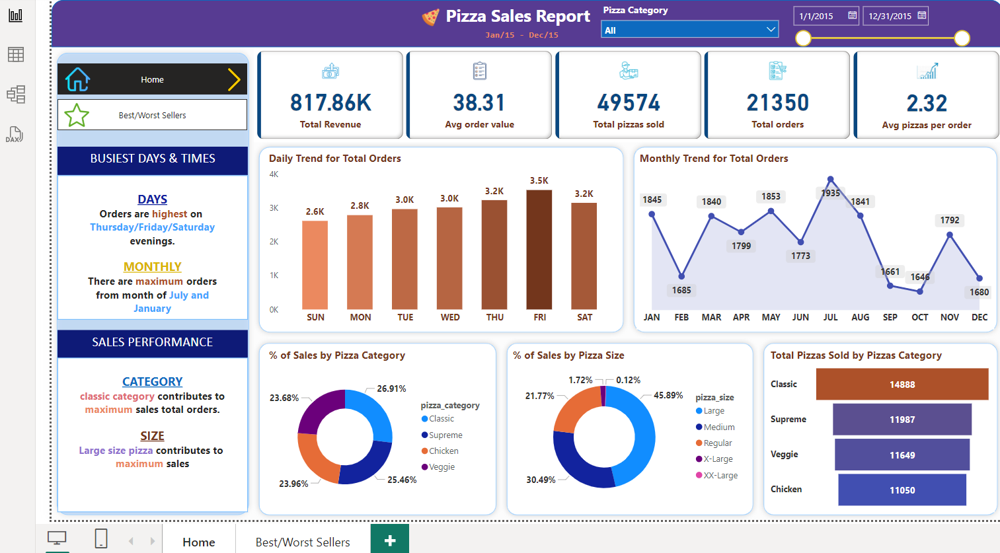

# Sales-Analysis-SQL-PowerBI
End-to-end sales trends data analysis project using SQL and Power BI.  

**Overview**  
End-to-end sales data analysis project using SQL and Power BI. Tasks included cleaning and analyzing historical sales data, creating SQL queries for insights and building an interactive dashboard using KPIs, bar charts, filters, donut charts etc. Ensured accuracy by cross-verifying Power BI results with SQL query outputs.  
Delivered actionable insights to optimize sales strategies.  

**Tools**: SQL, Power BI  

